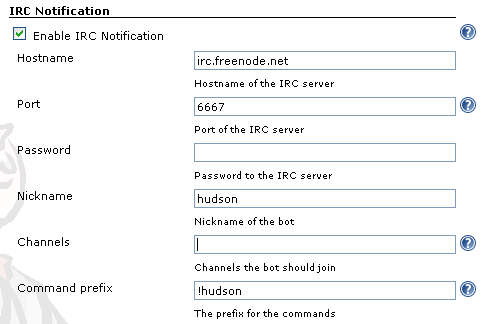

= Changelog

[[IRCPlugin-Version-2.40]]
== Version 2.40 (2021-09-28)

https://github.com/jenkinsci/ircbot-plugin/compare/ircbot-2.39...jenkinsci:ircbot-2.40

* Some more recipe updates, dependency versions and cosmetic fixes

[[IRCPlugin-Version-2.39]]
== Version 2.39 (2021-09-08)

https://github.com/jenkinsci/ircbot-plugin/compare/ircbot-2.38...jenkinsci:ircbot-2.39

* Some more recipe updates, dependency versions and cosmetic fixes

[[IRCPlugin-Version-2.38]]
== Version 2.38 (2021-09-08)

https://github.com/jenkinsci/ircbot-plugin/compare/ircbot-2.37...jenkinsci:ircbot-2.38

* Updated build recipes to include dependabot and to keep the `pom.xml`
  style common with some other plugins to simplify cross-pollination
* Bumped several dependency versions
* Rectified parts of codebase to match the new quality constraints

[[IRCPlugin-Version-2.37]]
== Version 2.37 (2021-08-27)

https://github.com/jenkinsci/ircbot-plugin/compare/ircbot-2.36...jenkinsci:ircbot-2.37

* Remove usages of Guava

[[IRCPlugin-Version-2.36]]
== Version 2.36 (2020-12-12)

https://github.com/jenkinsci/ircbot-plugin/compare/ircbot-2.35...jenkinsci:ircbot-2.36

* Revised solution for job configuration UI broken after Jenkins core
  2.264 (dropped HTML tables)
* Modernized saving and processing of job and global configurations
** https://jenkins.io/security/advisory/2019-04-03/#SECURITY-829 should
   now be fixed
** Plain-text passwords were optionally "scrambled" for some years now,
   but in this release the changes done by @timja make use of standard
   `secretPassword` fields. To update the on-disk representation of
   your IRC user and channel passwords, it should suffice to open and
   save your Jenkins global configuration after upgrading the plugin.
** Note that some field names would be updated in the configuration file 
   `$JENKINS_HOME/hudson.plugins.ircbot.IrcPublisher.xml` after this
   upgrade.
* Changed default IRC nickname for new deployments of the bot to `jenkins`
  (from `jenkins-bot`) be in limits set by RFC 2812 (9 chars), and added
  notes to the nickname editing fields in the UI (global config of the
  server as a client to IRC; individual users' configs to link their IRC
  accounts to Jenkins account)

[[IRCPlugin-Version-2.35]]
[[IRCPlugin-Version-2.34]]
== Version 2.34 and 2.35 (2020-12-05)

https://github.com/jenkinsci/ircbot-plugin/compare/ircbot-2.33...jenkinsci:ircbot-2.35

* First-shot solution for job configuration UI broken after Jenkins core 2.264 (dropped HTML tables)
* Refresh plugin recipe
* Further docs migration into Git

[[IRCPlugin-Version-2.33]]
[[IRCPlugin-Version-2.32]]
== Version 2.32 and 2.33 (2020-04-23)

https://github.com/jenkinsci/ircbot-plugin/compare/ircbot-2.31...jenkinsci:ircbot-2.33

* Fixed use of default targets from global config
* Ported documentation from old Wiki to in-codebase README

[[IRCPlugin-Version-2.31]]
== Version 2.31 (2019-08-09)

https://github.com/jenkinsci/ircbot-plugin/compare/ircbot-2.30...jenkinsci:ircbot-2.31

* Added a Jenkinsfile to CI-test the plugin itself:
https://github.com/jenkinsci/ircbot-plugin/pull/19
* Non-functional whitespace, javadoc and style fixes in the codebase for
better maintainability:
https://github.com/jenkinsci/ircbot-plugin/pull/20
* Added pipeline support to match capabilities of
instant-messaging-plugin release 1.36 (not fully published) and 1.37:
https://github.com/jenkinsci/ircbot-plugin/pull/21 and then 1.38:
https://github.com/jenkinsci/ircbot-plugin/pull/23
** So now there is an `ircNotify()` step with numerous supported
options (or default activity if none are passed) for `Jenkinsfile`
scripts!
* Added a `customMessage` option to instantly post the specified
message to specified IM target(s) as the payload of a step (not tied
into notification strategies for build start/completion): part of
https://github.com/jenkinsci/ircbot-plugin/pull/21
* Note that currently there is special syntax for build-start
notifications from a pipeline step (e.g. `ircNotify notifyOnStart:true`)
which is intended as a *temporary* solution to the problem of not having
support for an IM-specific `options{...}` setting in pipelines yet, and
so reporting "NOT BUILT" (via completion-notification mode) if there was
no verdict yet

[[IRCPlugin-Version-2.30]]
== Version 2.30 (2017-08-25)

* A rapid series of releases (2.28, 2.29, 2.30) led up to addition of
SASL in PircBotX, and some warnings fixes

[[IRCPlugin-Version-2.27]]
== Version 2.27 (2016-03-03)

* Bump of PircBotX and other dependencies versions

[[IRCPlugin-Version-2.26]]
== Version 2.26 (2015-02-19)

* don't make concurrent builds wait for the previous build (with
instant-messaging-plugin 1.33)
https://issues.jenkins-ci.org/browse/JENKINS-26892[JENKINS-26892]
* make delay between messages configurable via system property
"hudson.plugins.ircbot.messageRate"
* try to connect to NickServ protected up to 2 minutes in case NickServ
is reacting very slowly

[[IRCPlugin-Version-2.25]]
== Version 2.25 (Apr 2, 2014)

* Fixed a NullPointerException introduced in 2.24
https://issues.jenkins-ci.org/browse/JENKINS-22478[JENKINS-22478]

[[IRCPlugin-Version-2.24]]
== Version 2.24 (Mar 29, 2014)

* Added basic support for SOCKS proxies (thanks Andrew Bonney)
* Fixed: dropped whitespace if IRC colors were used
https://issues.jenkins-ci.org/browse/JENKINS-22360[JENKINS-22360]
(thanks Marius Gedminas)
* Updated to PircBotX 1.9

[[IRCPlugin-Version-2.23]]
== Version 2.23 (May 22, 2013)

* new option to disallow bot commands from private chats
* new option to trust self-signed SSL certificates

[[IRCPlugin-Version-2.22]]
== Version 2.22 (Mar 1, 2013)

* fixed a problem with reconnects
(https://issues.jenkins-ci.org/browse/JENKINS-17017[JENKINS-17017])
* Update to PircBotX 1.8
(https://code.google.com/p/pircbotx/wiki/ChangeLog#1.8_-_January_11th,_2013)

[[IRCPlugin-Version-2.21]]
== Version 2.21 (Dec 15, 2012)

* new option to colorize build notifications based on the build
outcome. +
Note that this feature may change in the future - especially regarding
'what' is colorized and the colors!
* fixed https://issues.jenkins-ci.org/browse/JENKINS-13697[issue
#13967] (ArrayIndexOutOfBounds Exception when I try to setup a second
IRC channel in Jenkins configuration)

[[IRCPlugin-Version-2.20]]
== Version 2.20 (Oct 13, 2012)

* fixed a bug when updating from previous versions on Windows

[[IRCPlugin-Version-2.19]]
== Version 2.19

* See https://plugins.jenkins.io/instant-messaging/[instant-messaging
plugin] 1.22 for new features. Also:
* Make IRC login name configurable
https://issues.jenkins-ci.org/browse/JENKINS-14467[JENKINS-14467]
* Update to PircBotX 1.7

[[IRCPlugin-Version-2.18]]
== Version 2.18

* fixed: unable to connect to ircu servers
https://issues.jenkins-ci.org/browse/JENKINS-11623[JENKINS-11623]
* See https://plugins.jenkins.io/instant-messaging/[instant-messaging
plugin] 1.21 for more new features

[[IRCPlugin-Version-2.17]]
== Version 2.17

skipped

[[IRCPlugin-Version-2.16]]
== Version 2.16

* fixed: password authentication not working since 2.14
(https://issues.jenkins-ci.org/browse/JENKINS-10862[JENKINS-10862])

[[IRCPlugin-Version-2.15]]
== Version 2.15

* fixed: NickServ password wasn't saved
(https://issues.jenkins-ci.org/browse/JENKINS-10145[JENKINS-10145])

[[IRCPlugin-Version-2.14]]
== Version 2.14

* Support SSL connections
(https://issues.jenkins-ci.org/browse/JENKINS-3543[JENKINS-3543]) 
** *Attention:* as the underlying IRC library had to be replaced to
achieve this, it's not completely unlikely that you could experience
some regressions. Please open a new issue in that case.
* New option to specify IRC server encoding
(https://issues.jenkins-ci.org/browse/JENKINS-10090[JENKINS-10090])

[[IRCPlugin-Version-2.13]]
== Version 2.13

* See
https://wiki.jenkins.io/display/JENKINS/Instant+Messaging+Plugin#InstantMessagingPlugin-Version1.16[Instant-Messaging
plugin 1.16] for new features

[[IRCPlugin-Version-2.12]]
== Version 2.12

* See
https://wiki.jenkins.io/display/JENKINS/Instant+Messaging+Plugin#InstantMessagingPlugin-Version1.15[Instant-Messaging
plugin 1.15] for new features

[[IRCPlugin-Version-2.11]]
== Version 2.11

* see instant-messaging plugin 1.14 for changes!

[[IRCPlugin-Version-2.9]]
== Version 2.9

* wait 5 seconds after identifying with NickServ before trying to join
channels. Should minimize problems if channels are restricted and the
NickServ identification isn't fast enough before the bot tries to join
the channels. Refs.
http://issues.jenkins-ci.org/browse/JENKINS-6600[JENKINS-6600] ,
http://issues.jenkins-ci.org/browse/JENKINS-8451[JENKINS-8451]

[[IRCPlugin-Version-2.8]]
== Version 2.8

* fixed: NullPointerException because of incorrect migration of old
configurations.
http://issues.jenkins-ci.org/browse/JENKINS-8001[JENKINS-8001]
* new feature: new chat notifier which prints the failing tests, too
http://issues.jenkins-ci.org/browse/JENKINS-7035[JENKINS-7035]

[[IRCPlugin-Version-2.7]]
== Version 2.7

* improvement: bot commands are now extensible and open for other
plugins (see class BotCommand).
* improvement: added an extension point to customize the message the bot
sends to chats for notification (see class BuildToChatNotifier).
* improvement: bot may be invited to channels
(http://issues.jenkins-ci.org/browse/JENKINS-6600[issue 6600] )

[[IRCPlugin-Version-2.6]]
== Version 2.6

* fixed: disconnects (and no reconnects) when changing the global config
(http://issues.jenkins-ci.org/browse/JENKINS-6933[issue #6933])
* improved behaviour when plugin is disabled. I.e. doesn't log
unnecessary stuff.
* fixed: plugins configure option not visible
http://issues.jenkins-ci.org/browse/JENKINS-5978[JENKINS-5978]
http://issues.jenkins-ci.org/browse/JENKINS-5233[JENKINS-5233]
* use UTF-8 as encoding for sending/receiving messages (previously used
default encoding of the Hudson server)

[[IRCPlugin-Version-2.5]]
== Version 2.5

* fixed: _notify upstream commiter_ would have notified committers of
'old' builds
(http://issues.jenkins-ci.org/browse/JENKINS-6712[JENKINS-6712])
* improvement: print useful project names for matrix jobs
(http://issues.jenkins-ci.org/browse/JENKINS-6560[JENKINS-6560] )
* fixed: don't delay Hudson startup
(http://issues.jenkins-ci.org/browse/JENKINS-4346[JENKINS-4346] )
* feature: _userstat_ command for bot
(http://issues.jenkins-ci.org/browse/JENKINS-6147[JENKINS-6147] )
* fixed: don't count offline computer for the executors count
(http://issues.jenkins-ci.org/browse/JENKINS-6387[JENKINS-6387])

[[IRCPlugin-Version-2.4]]
== Version 2.4

* fixed: bot output sometimes send to wrong user
(http://issues.jenkins-ci.org/browse/JENKINS-6484[JENKINS-6484])

[[IRCPlugin-Version-2.3]]
== Version 2.3

* allow to pass build parameters with the _build_ command
(http://issues.jenkins-ci.org/browse/JENKINS-5058[JENKINS-5058] ) *Make
sure that instant-messaging 1.7 or later is installed.*
* allow to set NickServ passwords

[[IRCPlugin-Version-2.2]]
== Version 2.2

* support password-protected chatrooms

[[IRCPlugin-Version-2.1]]
== Version 2.1

* new option to inform upstream committers
(http://issues.jenkins-ci.org/browse/JENKINS-4629[JENKINS-4629] )
* Bot uses /msg command to inform channels/users instead of /notice as
before. You can restore the old behaviour in the global configuration.
(http://issues.jenkins-ci.org/browse/JENKINS-5087[JENKINS-5087] )

[[IRCPlugin-Version-2.0]]
== Version 2.0

* This is the first version which is build upon the _instant-messaging_
plugin. *Make sure that instant-messaging 1.3 is installed.*
* *This version needs Hudson 1.319 or newer*
* Though much care has been taken to migrate settings from previous
versions, because of the amount of the changes it cannot be guaranteed
that all old settings are migrated correctly!
* This version supports all options that the Jabber plugin supports. See
https://wiki.jenkins.io/pages/viewpage.action?pageId=753770#[there] for
more info.
* Command responses are no longer send as private messages to the user.
Instead they are send to the channel. If you want private messages then
send the command as a private message to the bot.

[[IRCPlugin-Usage]]
== Usage

When you install this plugin, your Hudson configuration page gets
additional "IRC Notification" option as illustrated below: +
[.confluence-embedded-file-wrapper]## +
  +
In addition, each project should add a "Post-build Actions"> "IRC
Notification" configuration as illustrated below: +
  +
[.confluence-embedded-file-wrapper]## +
  +
For the project configuration, leave the Channels blank to default to
the channels defined in the controller IRC configration.
